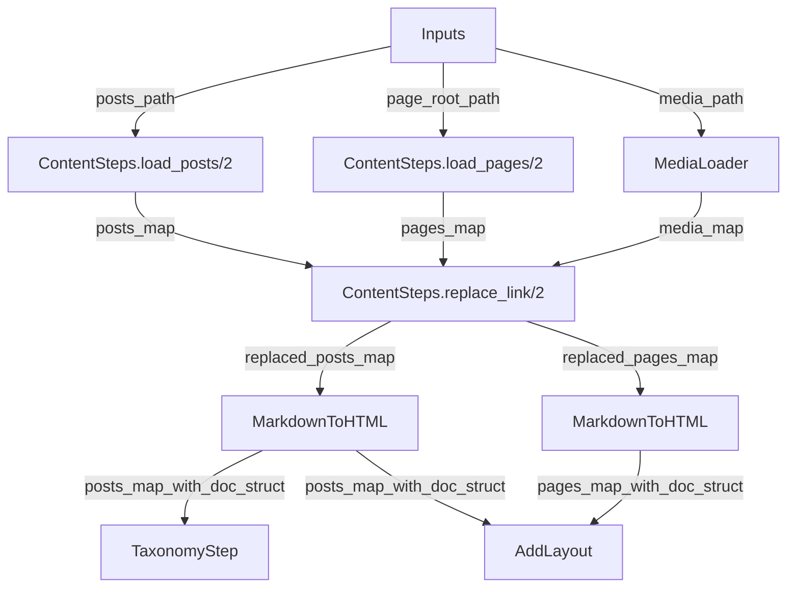

# Greenhouse

A project used to measure feasibility for [orchid](https://hex.pm/packages/orchid) in order to replace old [blog engine](https://github.com/GES233/simple_blog_engine).

## FlowChart

```mermaid
flowchart TD
  Inputs
  PL["ContentSteps.load_posts/2"]
  PgL["ContentSteps.load_pages/2"]
  ML["MediaLoader"]
  MH1["MarkdownToHTML"]
  MH2["MarkdownToHTML"]
  MR["ContentSteps.replace_link/2"]
  iTB["TaxonomyStep"]
  AL["AddLayout"]

  Inputs --posts_path--> PL
  Inputs --page_root_path--> PgL
  Inputs --media_path--> ML
  PL --posts_map--> MR
  PgL --pages_map--> MR
  ML --media_map--> MR
  MR --replaced_posts_map--> MH1
  MR --replaced_pages_map--> MH2
  MH1 --posts_map_with_doc_struct--> iTB
  MH1 --posts_map_with_doc_struct--> AL
  MH2 --pages_map_with_doc_struct--> AL

```
